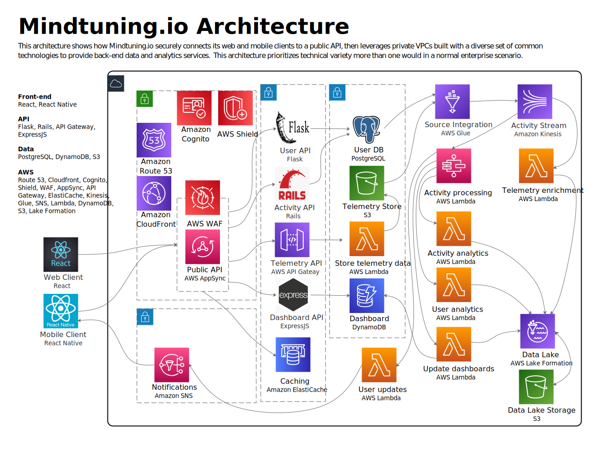

# Welcome to Mindtuning
Mindtuning is a mental health analytics platform that puts the power of artificial intelligence into your hands, helping you win the fight against stress, anxiety, and depression and fine-tune your mind.

## Architecture

  - [Architecture](#architecture)
    - [Architectural notes](#architectural-notes)
      - [API](#api)
      - [Persistence](#persistence)
      - [Orchestration](#orchestration)
  - [Contributing](#contributing)
  - [License](#license)
  
### Architectural notes
#### API
Multiple API frameworks are being tested for different sections of the API.  Eventually, one may win out and become the standard choice for the Mindtuning APIs.  However, at this stage exploration is the point and so variety has value in itself.

#### Persistence
Multiple persistence layers are being tested for data storage.  Reasonable choices have been made based on access patterns and data model but there could be changes in the future.

#### Orchestration & Streaming
The platform in question proposes to integrate broad device and app data into an analysis model that will drive insight into how device usage generally affects one's mental health.  Therefore, constant streams of data will be processed from enrolled devices.

Therefore data stream and pipeline orchestration solutions will be important.  At this point, the details are still evolving but for now AWS Kinesis and AWS Step Functions will provide streaming and orchestration functionality.
## Contributing
Please report any issues you see, or raise any questions you have, through Github Issues.

Please report any security vulnerabilities immediately.

There is no code of conduct yet, as there are no external contributors.  However, 

## License
This project is licensed under the [GNU Affero General Public License version 3](https://opensource.org/licenses/AGPL-3.0).